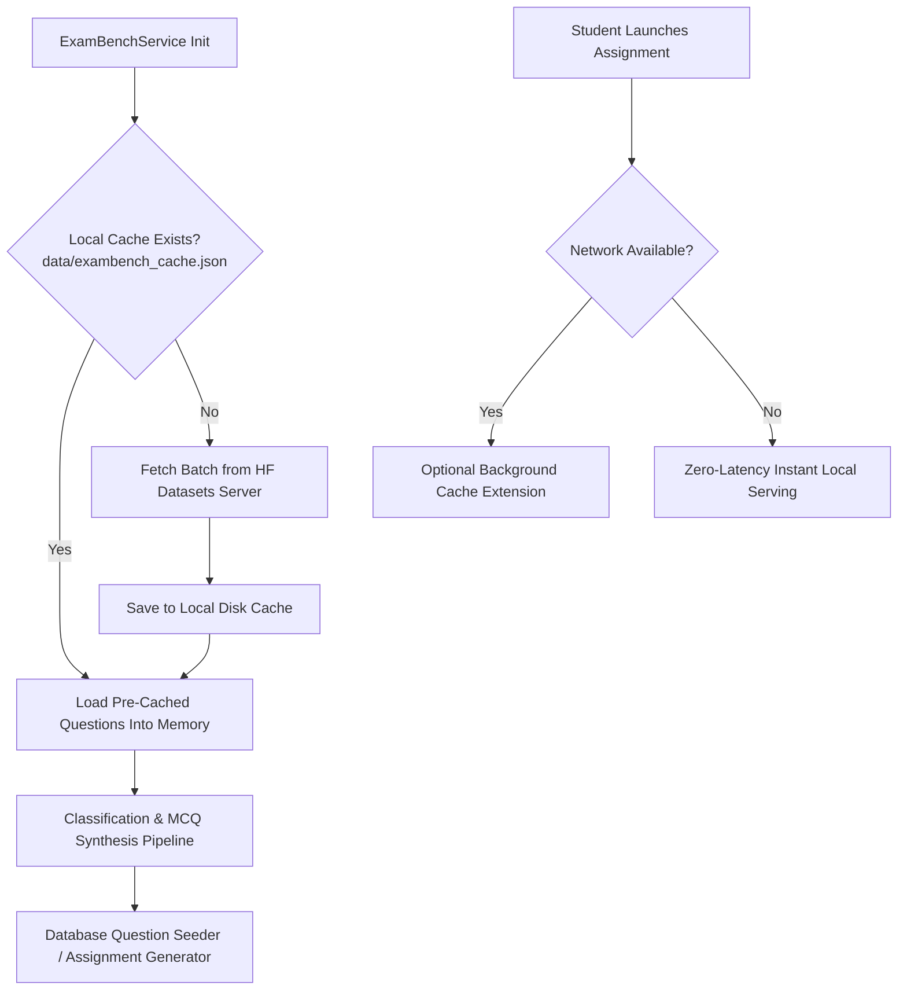
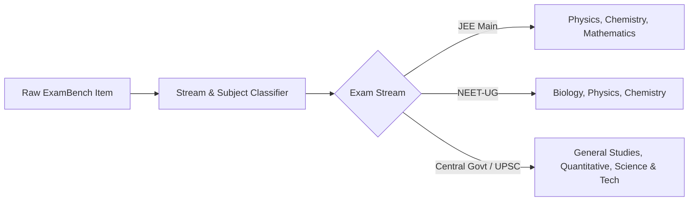

# ExamBench Integration & Daily Assignment Architecture

> **Platform Version**: 3.1  
> **Source Repository**: Hugging Face `169Pi/exambench` (405,906 Questions, 2.7 GB)  
> **Target Exam Tracks**: JEE Main (PCM), NEET-UG (PCB), Central Government & UPSC Civil Services  
> **Architecture Pattern**: Offline-First Caching with Live On-Demand HuggingFace Datasets-Server Synchronization

---

## 1. Executive Overview & Problem Context

Historically, competitive examination prep tools relied on small, static sets of Past Year Questions (PYQs). This introduced two severe structural limitations:
1. **Rote Memorization**: Students could recognize questions from past papers rather than solving from first principles.
2. **Narrow Exam Domain**: Confined strictly to standard JEE/NEET patterns, ignoring broader national and central government competitive exam pools.

Platform v3.1 resolves this by directly integrating the **Hugging Face `169Pi/exambench`** dataset, comprising **405,906 authentic competitive examination problems across all subjects and years**, while deploying a dedicated **Daily 3-Subject Assignment Engine** delivering 20–25 questions per subject daily.

---

## 2. Hugging Face Datasets-Server Architecture

### 2.1. API Specification
* **Base URL**: `https://datasets-server.huggingface.co/rows`
* **Query Parameters**:
  * `dataset=169Pi%2Fexambench`
  * `config=default`
  * `split=train`
  * `offset={offset}` (range: `0` to `405906`)
  * `length={length}` (standard batch: `50` to `100`)

### 2.2. Row Data Model
Each row from `169Pi/exambench` provides:
* `prompt` (*string*): The core problem statement or experimental prompt.
* `complex_cot` (*string*): Step-by-step chain-of-thought derivation, conceptual reasoning, and exam/subject context.
* `response` (*string*): Detailed mathematical resolution, intermediate steps, and verified final answer.

---

## 3. Resilient Offline-First Caching & Synchronization

To maintain the engine's offline-first design and prevent network latency from blocking the student experience:



* **Cache File**: `data/exambench_cache.json`
* **Startup Behavior**: Automatically loads pre-cached items; if network is accessible, extends the cache with newly sampled offsets.
* **Fallback Guarantee**: If Hugging Face is unreachable or internet is disconnected, the engine seamlessly operates at 100% functionality from local storage.

---

## 4. Stream Classification & Strict Scoping Pipeline

The engine enforces strict stream boundary conditions to prevent subject cross-contamination:



### Classification Rules
* **Mathematics (JEE)**: Triggered by keywords `calculus`, `integral`, `derivative`, `matrix`, `vector`, `algebra`, `z-transform`, `curve y =`, `differential equation`, `trigonometry`.
* **Physics (JEE / NEET)**: Triggered by keywords `transformer`, `magnetic field`, `ampère`, `electromagnetic`, `inclined plane`, `friction`, `projectile`, `newton`, `kinetic theory`, `thermodynamics`.
* **Chemistry (JEE / NEET)**: Triggered by keywords `phosphine`, `catalyst`, `reaction`, `orbital`, `equilibrium`, `stoichiometry`, `acid`, `base`, `hydrocarbon`, `polymer`, `desulfurization`.
* **Biology (NEET)**: Triggered by keywords `cell`, `dna`, `rna`, `immune`, `digestive`, `photosynthesis`, `hormone`, `auxin`, `tissue`, `kidney`, `liver`, `cardiac`, `genetics`, `botany`.
* **General Studies (Central Govt)**: Triggered by keywords `sustainable development`, `constitution`, `irrigation`, `policy`, `governance`, `public administration`.

---

## 5. Automated MCQ & Distractor Synthesis

To convert open-ended ExamBench problems into rigorous multiple-choice assessments, the `ExamBenchService` executes:

1. **Stem Extraction**: Preserves original `prompt` text.
2. **Correct Option Extraction**: Extracts the verified mathematical and conceptual answer from the initial sentences of `response`.
3. **Cognitive Distractor Modeling**: Generates 3 clinical error distractors mapped to specific failure modes:
   * **`CALCULATION_ERROR`**: Inverted scaling factor, doubled boundary constant, or sign slip.
   * **`CONCEPTUAL_ERROR`**: Assumes state invariance without accounting for field flux or active conservation laws.
   * **`FORMULA_SELECTION_ERROR`**: Employs static zero-order approximation ignoring higher-order non-linear gradients.
4. **Deterministic Position Scrambling**: Option letters (`A`, `B`, `C`, `D`) are randomized per question ID seed.
5. **Solution Derivation**: Embeds full chain-of-thought and derivation in `explanation`.

---

## 6. Daily 3-Subject Assignment Engine

### 6.1. Pedagogical Structure
* **Volume**: **20 to 25 questions per subject** across 3 subjects:
  * **JEE Main**: 20 Physics + 20 Chemistry + 20 Mathematics = **60 Questions**.
  * **NEET-UG**: 20 Biology + 20 Physics + 20 Chemistry = **60 Questions**.
* **Palette Navigation**: Dedicated 20-button matrix for each subject:
  * 🟢 **Answered** (Emerald)
  * 🟡 **Marked for Review** (Amber)
  * ⚪ **Not Answered** (Neutral Slate)
* **Debounced Autosave**: Student answers sync to the backend every 1.5 seconds without interrupting quiz flow.
* **Subject Scorecards**: Detailed score, accuracy percentage, and cognitive error diagnostics provided per subject upon submission.
* **Consistency Streak**: Daily counter increments when the student completes assignments across consecutive days.

### 6.2. State Lifecycle Machine
```
[NOT_STARTED]
      |
      v
[IN_PROGRESS] <-----> [AUTOSAVED VIA /save-progress]
      |
      v (Student clicks "Submit Daily Assignment")
[COMPLETED]
      |
      +---> Grades 3 Subjects
      +---> Updates BKT Mastery & IRT Ability
      +---> Logs Distractor Cognitive Errors
      +---> Advances Daily Streak Counter
```

---

## 7. Database Entities & Relationships

### `DailyAssignment` Table
* `assignment_id` (*PK, String 64*): Unique session key (e.g., `asgn_20260904_ab12cd`).
* `student_id` (*FK, String 64*): Associated student profile.
* `exam` (*String 32*): `JEE`, `NEET`, etc.
* `assignment_date` (*String 16*): `YYYY-MM-DD`.
* `title` (*String 128*): Formatted assignment heading.
* `status` (*String 32*): `IN_PROGRESS` or `COMPLETED`.
* `total_questions` (*Integer*): 60 to 75.
* `completed_count` (*Integer*): Total answered questions.
* `correct_count` (*Integer*): Correctly answered count.
* `score_percentage` (*Float*): 0.0 to 100.0%.
* `subject_scores` (*JSON*): Detailed accuracy metrics per subject.
* `time_taken_seconds` (*Integer*): Total active time.
* `created_at`, `submitted_at` (*DateTime*).

### `DailyAssignmentItem` Table
* `id` (*PK, Integer*): Auto-increment primary key.
* `assignment_id` (*FK, String 64*): Links to `DailyAssignment`.
* `question_id` (*FK, String 64*): Links to `Question` (ExamBench question).
* `subject` (*String 64*): `Physics`, `Chemistry`, `Mathematics`, `Biology`.
* `sequence_index` (*Integer*): 1 to 60.
* `student_answer` (*String 8*): `A`, `B`, `C`, or `D`.
* `is_correct` (*Boolean*): Grading outcome.
* `is_marked_review` (*Boolean*): Flagged state.
* `time_taken_seconds` (*Integer*): Time spent on this item.

---

## 8. Verification & Test Evidence

All 19 automated test suites pass with 100% success rate:
* `tests/test_exambench_and_assignments.py`: Validates live API loading, subject classification, strict stream scoping, 60-question generation, autosaving, submission, and streak calculations.
* `tests/test_quiz_engine.py`: Validates diagnostic quiz and topic drill lifecycle.
* `tests/test_irt_bkt.py`: Validates Bayesian Knowledge Tracing and Item Response Theory ability updates.
* `tests/test_priority.py`: Validates DAG-based curriculum priorities.
* `tests/test_roadmap.py`: Validates dynamic roadmap generation upon assessment completion.
