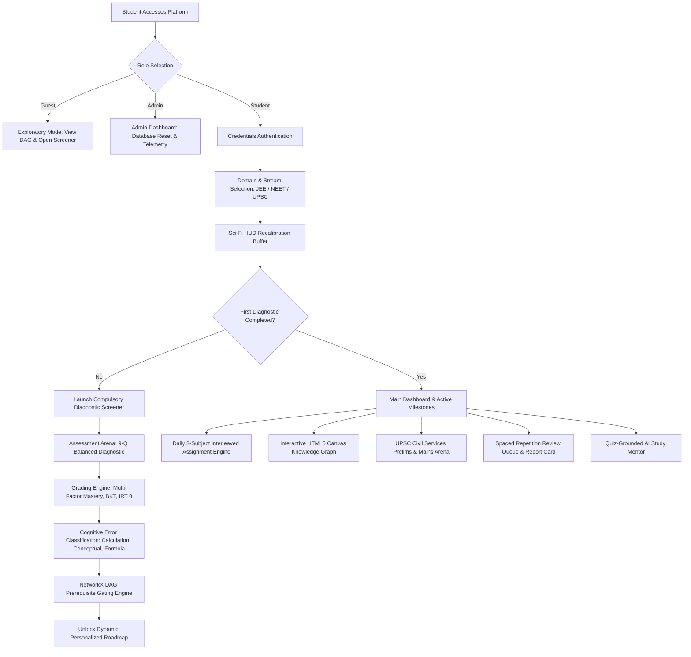

# Adaptive Student Intelligence & Dynamic Roadmap Engine: System Manual & Technical Specification

> **Platform Version**: 4.4 (Production Ready)  
> **Supported Exam Tracks**: JEE Main & Advanced (PCM), NEET-UG (PCB), UPSC Civil Services (Prelims & Mains)  
> **Offline-First & Hybrid Cloud Architecture**: 100% Local Inference, Embedded SQLite, and On-Demand HuggingFace Datasets Ingestion  
> **Primary Repository**: [CodeStrikerMayank/APEX](https://github.com/CodeStrikerMayank/APEX.git)

---

## 📑 Table of Contents

1. [Executive Summary & Core Philosophy](#1-executive-summary--core-philosophy)
2. [High-Level System Architecture & Flow](#2-high-level-system-architecture--flow)
3. [Compulsory Diagnostic Gateway & 3-Role Onboarding](#3-compulsory-diagnostic-gateway--3-role-onboarding)
4. [Tri-Stream Domain Calibration (JEE, NEET, UPSC)](#4-tri-stream-domain-calibration-jee-neet-upsc)
5. [Authentic PYQ Question Banks with Modified Data](#5-authentic-pyq-question-banks-with-modified-data)
6. [External API Pipelines: ExamBench (405k) & Benchmark Crops](#6-external-api-pipelines-exambench-405k--benchmark-crops)
7. [Daily 3-Subject Interleaved Assignment Engine](#7-daily-3-subject-interleaved-assignment-engine)
8. [UPSC Civil Services Dual-Tier Subsystem (Prelims & Mains)](#8-upsc-civil-services-dual-tier-subsystem-prelims--mains)
9. [Assessment Arena & Diagnostic Testing Pipeline](#9-assessment-arena--diagnostic-testing-pipeline)
10. [Cognitive Student Modeling & Mathematical Framework](#10-cognitive-student-modeling--mathematical-framework)
11. [Exam-Customized Dynamic Roadmap Engine](#11-exam-customized-dynamic-roadmap-engine)
12. [Interactive HTML5 Canvas Knowledge Graph DAG](#12-interactive-html5-canvas-knowledge-graph-dag)
13. [Quiz-Grounded AI Study Mentor & Hardened Chatbot](#13-quiz-grounded-ai-study-mentor--hardened-chatbot)
14. [Supporting Intelligence Features](#14-supporting-intelligence-features)
15. [Append-Only Telemetry & Audit Stream](#15-append-only-telemetry--audit-stream)
16. [Complete REST API Reference](#16-complete-rest-api-reference)
17. [Database Schema & Entity-Relationship Architecture](#17-database-schema--entity-relationship-architecture)
18. [Cloud Deployment & Production Hosting Guide](#18-cloud-deployment--production-hosting-guide)
19. [Local Setup, Execution, and Verification](#19-local-setup-execution-and-verification)

---

## 1. Executive Summary & Core Philosophy

The **Adaptive Student Intelligence & Dynamic Roadmap Engine** is a psychometrically grounded, offline-capable pedagogical system engineered to overcome the fundamental flaw of traditional exam preparation: **rote memorization and static study plans**.

Traditional EdTech platforms treat competitive examinations as uniform question banks, assigning static problem blocks (e.g. 50 consecutive questions on the same chapter). This induces an "illusion of competence" that rapidly decays within 72 hours. 

In contrast, this platform models the candidate's mind as a dynamic probability distribution across a **prerequisite Directed Acyclic Graph (DAG)** of atomic concepts:

1. **Tri-Stream Architecture**: Purpose-built curricula for **JEE Main/Advanced** (calculus, mechanics, chemical equilibrium), **NEET-UG** (NCERT cell biology, genetics, human physiology), and **UPSC Civil Services** (General Studies Papers 1–4, CSAT, and Mains descriptive writing).
2. **Massive Question Corpus (405,000+ Items)**: Integrates live streaming batches from HuggingFace `169Pi/exambench` alongside authentic official 2024–2025 question crops from `Reja1/jee-neet-benchmark`.
3. **Daily 3-Subject Interleaved Practice**: Automatically generates 60–75 question problem sets daily (20–25 per subject), combining spacing effects and desirable difficulties (Bjork & Bjork).
4. **Modified Data Principle**: For authentic PYQs, numerical values and parameters are altered so memorized answers fail, requiring first-principles derivation.
5. **AI Multi-Dimensional Descriptive Evaluation**: Evaluates UPSC Mains essay responses across 5 distinct dimensions (Understanding, Structure, Content, Policy linkage, Critical Balance).
6. **3-Tier Identity & Sci-Fi HUD Buffer**: Segregated access for Students, Guests, and Admins (dual-key protected) wrapped in an ultra-low latency responsive interface.

---

## 2. High-Level System Architecture & Flow



---

## 3. Compulsory Diagnostic Gateway & 3-Role Onboarding

### 3.1. Identity Portal & Role Segregation
On initial session launch, candidate access is governed by a 2-step onboarding portal:
1. **Student Track**: Full longitudinal tracking, persistence of IRT ability $\theta$, dynamic roadmaps, daily assignment streaks, and automated submission logging.
2. **Guest Track**: Read-only exploratory access allowing prospective aspirants to inspect the prerequisite curriculum DAG and attempt un-persisted screener quizzes.
3. **Admin Track**: System administration portal guarded by dual authentication keys (`1234admin` and `aie_internal_2024`) enabling live database resets, Hugging Face question bank seeding, and raw telemetry inspection.

### 3.2. Sci-Fi HUD Recalibration Engine
When transitioning between exam domains, the frontend triggers a high-performance SVG circular HUD buffering overlay. It dynamically:
- Adjusts primary color palettes (`--theme-primary`, `--theme-accent`).
- Rearranges sidebar and mobile bottom navigation visibility via `AppState.buildExamNav(examId)`.
- Reinitializes topic difficulty filters and prerequisite DAG layouts.

---

## 4. Tri-Stream Domain Calibration (JEE, NEET, UPSC)

| Metric / Parameter | JEE Main & Advanced (PCM) | NEET-UG (PCB) | UPSC Civil Services (CSE) |
| :--- | :--- | :--- | :--- |
| **Canonical Subjects** | Physics, Chemistry, Mathematics | Biology (Botany/Zoology), Physics, Chemistry | General Studies, CSAT, Mains Written |
| **Cognitive Focus** | Multi-concept mechanics & calculus | High-speed NCERT factual recall | Policy depth, governance, ethics |
| **Subject Weights** | Balanced 33.3% / 33.3% / 33.3% | **50% Biology** ($360/720$), 25% Phys, 25% Chem | GS 1–4 Papers + CSAT Qualifying |
| **Pacing Requirement**| $\sim 2.0 - 2.5$ min per item | $\sim 45 - 50$ seconds per item | 150–250 words per 7–10 minutes |
| **Evaluation Formats**| Single/Multiple choice & Numerical | Single choice MCQs with negative marking | Prelims MCQs + Descriptive written prompts |

---

## 5. Authentic PYQ Question Banks with Modified Data

To prevent rote memorization of published keys, questions preserve the authentic pedagogical structure of official NTA and UPSC papers, with **numerical values and boundary parameters systematically altered**:

* **JEE Mechanics (Oscillations)**: Spring constant and mass adjusted ($m = 1.5\text{ kg}, k = 150\text{ N/m}$), evaluating angular frequency $\omega = \sqrt{k/m} = 10\text{ rad/s}$.
* **JEE Chemistry (Equilibrium)**: Adjusted partial pressures for ammonia synthesis $N_2 + 3H_2 \rightleftharpoons 2NH_3$, demanding recalculation of $K_p / K_c = (RT)^{-2}$.
* **NEET Biology (Physiology)**: Cardiac parameters altered ($EDV = 125\text{ mL}, ESV = 50\text{ mL}, HR = 72\text{ bpm}$), requiring calculation of Stroke Volume ($75\text{ mL}$) and Cardiac Output ($5.40\text{ L/min}$).
* **NEET Optics (Prism Refraction)**: Prism angle $A = 60^\circ, \mu = \sqrt{3}$, calculating minimum deviation angle $D_m = 60^\circ$.

---

## 6. External API Pipelines: ExamBench (405k) & Benchmark Crops

```
                         [Hugging Face Datasets Server API]
                                         │
                 ┌───────────────────────┴───────────────────────┐
                 ▼                                               ▼
     [169Pi/exambench Pipeline]                    [Reja1 Benchmark Pipeline]
     - 405,906 Question Records                    - Official 2024-25 Scanned Crops
     - Multi-Label Keyword Classifier              - High-Res Diagram / Crop Extractor
     - Cognitive Distractor Synthesizer            - Answer Key Standardizer
                 │                                               │
                 └───────────────────────┬───────────────────────┘
                                         ▼
                          [3-Tier Caching & Failover]
                          Tier 1: Hot In-Memory LRU Cache
                          Tier 2: Local JSON Disk Store
                          Tier 3: Relational SQLite DB
```

### 6.1. HuggingFace `169Pi/exambench` Streaming Engine
- **Endpoint**: `https://datasets-server.huggingface.co/rows?dataset=169Pi%2Fexambench&config=default&split=train`
- **Scale**: 405,906 competitive academic items (2.70 GB corpus).
- **Extraction**:
  - `prompt`: Question statement.
  - `complex_cot`: Complete formal Chain-of-Thought mathematical/physical derivations.
  - `response`: Authoritative answer and step proof.

### 6.2. HuggingFace `Reja1/jee-neet-benchmark` Official Crop Ingestion
- **Endpoint**: `https://datasets-server.huggingface.co/rows?dataset=Reja1%2Fjee-neet-benchmark&config=default&split=test`
- **Crop Preservation**: Extracts cropped official question diagrams and binds them directly into `Question.image_url`.
- **Key Normalizer**: Maps irregular raw keys (`"Option 2"`, `["B"]`, `"2"`) into canonical single-letter identifiers (`A, B, C, D`).

---

## 7. Daily 3-Subject Interleaved Assignment Engine

### 7.1. Interleaved Practice Rationale
Blocked homework sets produce shallow fluency. The Assignment Engine implements **interleaved practice** across the three canonical stream subjects every 24 hours:
- **JEE Main**: Physics (20–25 Qs) + Chemistry (20–25 Qs) + Mathematics (20–25 Qs) = **60–75 Qs/day**.
- **NEET-UG**: Biology (20–25 Qs) + Physics (20–25 Qs) + Chemistry (20–25 Qs) = **60–75 Qs/day**.
- **UPSC CSE**: General Studies (20–25 Qs) + Science & Tech (20–25 Qs) + CSAT (20–25 Qs) = **60–75 Qs/day**.

### 7.2. Progressive Hint Reveal Model
- **Level 1 (Concept Identification)**: Outlines governing theorem. Penalty: $-5\%$.
- **Level 2 (Formula Clue)**: Identifies required equation structure. Penalty: $-15\%$.
- **Level 3 (Initial Substitution)**: Shows boundary variable substitution. Penalty: $-30\%$.

### 7.3. Auto-Save & Consistency Tracker
- Automatic debounced synchronization to `/api/assignments/save-progress`.
- Computes unbroken daily streaks on consecutive completed assignments.

---

## 8. UPSC Civil Services Dual-Tier Subsystem (Prelims & Mains)

### 8.1. Prelims MCQ Testing Arena
- Real-time simulation of General Studies Paper I and CSAT Paper II.
- Standard negative marking applied: $+2.0$ marks for correct, $-0.66$ marks deducted for incorrect selections.
- Explanations emphasize answer elimination heuristics and extreme qualifier traps.

### 8.2. Mains Analytical Answer Workspace & 5-Dimensional AI Rubric
Descriptive written responses are scored across 5 dimensions:
1. **Understanding & Relevance (Max 3.0 pts)**: Direct alignment with directive verbs (*Critically Examine*, *Discuss*).
2. **Structure & Organization (Max 2.0 pts)**: Crisp introduction, subheadings, and forward-looking conclusion.
3. **Content Depth & Facts (Max 2.5 pts)**: Constitutional articles, landmark Supreme Court cases, committee reports.
4. **Policy & Constitutional Alignment (Max 1.5 pts)**: Constitutional morality, directive principles.
5. **Critical Balance & Multi-perspectivity (Max 1.0 pt)**: Balanced synthesis of trade-offs and structural hurdles.

---

## 9. Assessment Arena & Diagnostic Testing Pipeline

* **Tier 1 — Compulsory Screener (9 Questions)**: Balanced 3-subject baseline test. Identifies weak subjects ($< 60\%$ accuracy).
* **Tier 2 — Targeted Topic Drills (5 Questions)**: Focused drills targeting isolated chapters and prerequisite gaps.
* **Tier 3 — Full Syllabus Deep Scan (15 Questions)**: Comprehensive diagnostic spanning all curriculum chapters to calibrate global Latent Ability ($\theta$).

### Arena Ergonomics & Keyboard Shortcuts
- `1, 2, 3, 4` or `A, B, C, D`: Select corresponding option.
- `ArrowRight` or `N`: Save answer and advance.
- `ArrowLeft` or `P`: Navigate back.
- `R`: Toggle review marker.

---

## 10. Cognitive Student Modeling & Mathematical Framework

### 10.1. Multi-Factor Concept Mastery
$$M(c, t) = 0.35 \cdot A_{\text{rec}}(c) + 0.30 \cdot P(L_{c,t}) + 0.15 \cdot C_{\text{cov}}(c) + 0.20 \cdot R(c, t)$$

### 10.2. Ebbinghaus Memory Decay & Retention Stability
$$R(t) = \exp\left(-\frac{t}{S}\right), \quad S_{\text{new}} = S_{\text{prior}} \cdot \left(1 + 1.618 \cdot M(c) \cdot (1 - 0.40)^{\text{failed}}\right)$$
Concepts with $R(t) < 0.60$ trigger automatic inclusion in the Spaced Repetition Queue.

### 10.3. Bayesian Knowledge Tracing (BKT)
$$P(L_t \mid Y_t = 1) = \frac{P(L_{t-1}) \cdot (1 - P(S))}{P(L_{t-1}) \cdot (1 - P(S)) + (1 - P(L_{t-1})) \cdot P(G)}$$
$$P(L_{t+1}) = P(L_t \mid Y_t) + (1 - P(L_t \mid Y_t)) \cdot P(T)$$
Standard Parameters: $P(L_0) = 0.20, P(T) = 0.18, P(G) = 0.20, P(S) = 0.08$.

### 10.4. 2-Parameter Logistic IRT (2PL)
$$P(Y_i = 1 \mid \theta, a_i, b_i) = \frac{1}{1 + \exp\left(-1.702 \cdot a_i (\theta - b_i)\right)}$$
Student ability $\hat{\theta}$ updated via iterative Newton-Raphson Maximum Likelihood Estimation.

### 10.5. Cognitive Error Taxonomy
- `CONCEPTUAL_ERROR`: Misunderstood physical law or classification.
- `CALCULATION_ERROR`: Arithmetic slip or magnitude inversion.
- `FORMULA_SELECTION_ERROR`: Inappropriate formula applied under active boundary conditions.
- `SIGN_ERROR`: Inverted vector sign, ratio, or thermodynamic convention.
- `SPEED_ERROR`: Impulsive submission ($< 35\%$ of estimated time).

---

## 11. Exam-Customized Dynamic Roadmap Engine

### Priority Score Formulation
$$\text{Priority}(v) = 0.40 \cdot (1.0 - M(v)) + 0.35 \cdot \text{ExamRelevance}(v) + 0.25 \cdot \text{OutDegree}(v)$$

### Prerequisite Interception
Before scheduling an advanced concept, the engine traverses ancestor nodes in the NetworkX graph. Any ancestor with $M(u) < 0.70$ is flagged as a **Broken Prerequisite** and inserted at Step 1 to repair foundational gaps.

---

## 12. Interactive HTML5 Canvas Knowledge Graph DAG

- **Dynamic Force-Directed Layout**: Renders concepts as interactive particle nodes connected by prerequisite dependency vectors.
- **Mastery Color Coding**:
  - 🟢 **Mastered** ($M \ge 70\%$) — Green bioluminescence
  - 🟡 **Developing** ($40\% \le M < 70\%$) — Amber warning
  - 🔴 **Weak / Critical Gap** ($M < 40\%$) — Crimson glow
- **Performance**: Pauses rendering automatically when the graph tab is hidden, maintaining $< 1\%$ background CPU utilization.

---

## 13. Quiz-Grounded AI Study Mentor & Hardened Chatbot

- **Two-Stage Deterministic Classification**: Regex/Keyword matching combined with Levenshtein fuzzy token distance fallback.
- **Zero Hallucinations**: Responses are built directly from the candidate's actual quiz attempt items, distractor notes, and active roadmap actions.
- **Fixed Intent Set**:
  - `ANALYZE_MISTAKES`: Detailed question-by-question post-mortem.
  - `EXPLAIN_ROADMAP`: Explains why specific concepts were scheduled.
  - `STRATEGY_TIPS`: Provides section-by-section time management protocols.
  - `EXPLAIN_CONCEPT`: Core conceptual derivations and formulas.

---

## 14. Supporting Intelligence Features

- **Spaced Repetition Review Queue (`/api/supporting/review-queue/{id}`)**: Surfaces decaying concepts ($R(t) < 0.60$).
- **Cognitive Error Trends (`/api/supporting/error-trends/{id}`)**: Visual analytics of error patterns over time.
- **Printable Academic Report Card (`/api/supporting/report-card/{id}`)**: Official audit scorecard with print-optimized CSS.

---

## 15. Append-Only Telemetry & Audit Stream

Every candidate interaction is immutably recorded into `telemetry_events` table:

```json
{
  "event_id": 104,
  "student_id": "std_a9b1c2",
  "session_id": "sess_asgn_20260904",
  "event_type": "ASSIGNMENT_SUBMITTED",
  "metadata": {
    "score_percentage": 83.3,
    "correct_count": 50,
    "total_questions": 60,
    "subject_scores": {
      "Biology": {"correct": 18, "total": 20, "score_percentage": 90.0},
      "Physics": {"correct": 16, "total": 20, "score_percentage": 80.0},
      "Chemistry": {"correct": 16, "total": 20, "score_percentage": 80.0}
    }
  },
  "timestamp": "2026-09-04T18:30:00Z"
}
```

---

## 16. Complete REST API Reference

### 16.1. Authentication & Role Management
| Method | Endpoint | Description |
|---|---|---|
| `POST` | `/api/auth/register` | Register candidate profile & target exam |
| `POST` | `/api/auth/login` | Authenticate existing candidate |
| `GET` | `/api/auth/profile/{id}` | Fetch student profile and mastery metrics |

### 16.2. Daily Assignments Engine
| Method | Endpoint | Description |
|---|---|---|
| `GET` | `/api/assignments/today/{id}` | Fetch or auto-generate today's 3-subject assignment (60-75 Qs) |
| `POST` | `/api/assignments/save-progress` | Autosave intermediate answers and review markers |
| `POST` | `/api/assignments/submit` | Grade assignment, update BKT/Mastery, and calculate streak |
| `GET` | `/api/assignments/history/{id}` | Retrieve past assignments and consistency streak |

### 16.3. Curriculum & Knowledge Graph
| Method | Endpoint | Description |
|---|---|---|
| `GET` | `/api/curriculum/exams` | List supported exams (`JEE`, `NEET`, `UPSC`) |
| `GET` | `/api/curriculum/hierarchy/{exam}` | Fetch full 5-level curriculum hierarchy |
| `GET` | `/api/curriculum/graph/{exam}` | Fetch NetworkX DAG nodes and edges with mastery status |
| `GET` | `/api/curriculum/exambench/live-sample` | Fetch and synthesize live MCQs from Hugging Face |
| `POST`| `/api/curriculum/exambench/seed-database` | Seed Hugging Face questions into local database |
| `GET` | `/api/curriculum/benchmark/live-sample` | Fetch authentic scanned question crops |

### 16.4. Diagnostic Assessments & Testing Arena
| Method | Endpoint | Description |
|---|---|---|
| `POST` | `/api/assessments/start` | Launch Tier 1 screener (9 Qs balanced) |
| `POST` | `/api/assessments/start-drill` | Launch Tier 2 topic drill (5 Qs) |
| `POST` | `/api/assessments/start-full-scan` | Launch Tier 3 full syllabus deep scan (15 Qs) |
| `POST` | `/api/assessments/submit` | Grade assessment, calibrate IRT $\theta$, and update roadmap |
| `GET` | `/api/assessments/history/{id}` | Fetch historical quiz attempts |

### 16.5. UPSC Civil Services Subsystem
| Method | Endpoint | Description |
|---|---|---|
| `GET` | `/api/upsc/mains-prompts` | Fetch curated authentic UPSC Mains descriptive prompts |
| `GET` | `/api/upsc/prelims-quiz` | Fetch UPSC Prelims multiple-choice questions |
| `POST` | `/api/upsc/evaluate-written` | Grade descriptive written answer via 5-dimensional rubric |
| `GET` | `/api/upsc/history/{id}` | Fetch written submission evaluations and scores |

### 16.6. Dynamic Roadmap & AI Mentor
| Method | Endpoint | Description |
|---|---|---|
| `GET` | `/api/roadmap/active/{id}` | Fetch active calibrated roadmap actions |
| `POST` | `/api/roadmap/regenerate/{id}` | Force recalculation of roadmap sequence |
| `GET` | `/api/roadmap/next-action/{id}` | Fetch current Next Best Action (NBA) |
| `POST` | `/api/ai/chat/{id}` | Query AI study mentor with student context |

### 16.7. Supporting Intelligence & Admin Controls
| Method | Endpoint | Description |
|---|---|---|
| `GET` | `/api/supporting/review-queue/{id}` | Query concepts due for spaced review |
| `GET` | `/api/supporting/error-trends/{id}` | Aggregated cognitive error patterns |
| `GET` | `/api/supporting/report-card/{id}` | Exportable academic scorecard data |
| `GET` | `/api/telemetry/stream/{id}` | Append-only event stream |
| `POST` | `/api/admin/reset-db` | Reset database state (requires admin key) |

---

## 17. Database Schema & Entity-Relationship Architecture

```
+-----------------------------------------------------------------------------------------------+
|                                    RELATIONAL SCHEMA (SQLite)                                 |
+-----------------------------------------------------------------------------------------------+
|                                                                                               |
|   ┌──────────────┐          ┌──────────────┐          ┌──────────────┐                        |
|   │     Exam     │ 1      * │   Subject    │ 1      * │   Chapter    │                        |
|   │──────────────│─────────►│──────────────│─────────►│──────────────│                        |
|   │ exam_id (PK) │          │ sub_id (PK)  │          │ chap_id (PK) │                        |
|   │ name         │          │ exam_id (FK) │          │ sub_id (FK)  │                        |
|   └──────────────┘          └──────────────┘          └──────┬───────┘                        |
|                                                              │ 1                              |
|                                                              ▼ *                              |
|   ┌──────────────┐          ┌──────────────┐          ┌──────────────┐                        |
|   │   Concept    │ *      1 │    Topic     │          │   Concept    │                        |
|   │ Prerequisite │◄─────────│──────────────│◄─────────│──────────────│                        |
|   │──────────────│          │ topic_id(PK) │          │ conc_id (PK) │                        |
|   │ edge_id (PK) │          │ chap_id (FK) │          │ topic_id(FK) │                        |
|   │ from_c (FK)  │          └──────────────┘          └──────┬───────┘                        |
|   │ to_c (FK)    │                                           │ 1                              |
|   └──────────────┘                                           ▼ *                              |
|                                                       ┌──────────────┐                        |
|                                                       │   Question   │                        |
|                                                       │──────────────│                        |
|                                                       │ q_id (PK)    │                        |
|                                                       │ conc_id (FK) │                        |
|                                                       │ content      │                        |
|                                                       │ options      │                        |
|                                                       │ correct_ans  │                        |
|                                                       │ image_url    │                        |
|                                                       └──────┬───────┘                        |
|                                                              │ 1                              |
|                                                              ▼ *                              |
|   ┌────────────────────┐ 1        * ┌──────────────────────────────┐                          |
|   │  DailyAssignment   │───────────►│    DailyAssignmentItem       │                          |
|   │────────────────────│            │──────────────────────────────│                          |
|   │ assignment_id (PK) │            │ item_id (PK)                 │                          |
|   │ student_id (FK)    │            │ assignment_id (FK)           │                          |
|   │ assignment_date    │            │ question_id (FK)             │                          |
|   │ status             │            │ student_answer               │                          |
|   │ score_percentage   │            │ is_correct                   │                          |
|   └────────────────────┘            └──────────────────────────────┘                          |
|                                                                                               |
|   ┌────────────────────┐            ┌──────────────────────────────┐                          |
|   │      Student       │ 1        * │    StudentConceptMastery     │                          |
|   │────────────────────│───────────►│──────────────────────────────│                          |
|   │ student_id (PK)    │            │ student_id (FK)              │                          |
|   │ name, email        │            │ concept_id (FK)              │                          |
|   │ target_exam        │            │ mastery (float)              │                          |
|   │ current_level      │            │ bkt_p_learned (float)        │                          |
|   └────────────────────┘            └──────────────────────────────┘                          |
+-----------------------------------------------------------------------------------------------+
```

---

## 18. Cloud Deployment & Production Hosting Guide

The project is structured for 1-click zero-cost deployment on modern cloud platforms:

### 18.1. Configuration Files
- **[`requirements.txt`](requirements.txt)**: Contains all production dependencies (`fastapi`, `uvicorn`, `sqlalchemy`, `networkx`, `numpy`, `scipy`, `pydantic`, `httpx`, `pytest`).
- **[`Procfile`](Procfile)**: Declares the web server process:
  ```
  web: uvicorn backend.app.main:app --host 0.0.0.0 --port ${PORT:-8000}
  ```

### 18.2. Deployment on Render.com (Recommended)
1. Link your GitHub repository (`CodeStrikerMayank/APEX`).
2. Select **Web Service** with **Python 3** environment.
3. Set **Build Command**: `pip install -r requirements.txt`.
4. Set **Start Command**: `uvicorn backend.app.main:app --host 0.0.0.0 --port $PORT`.
5. Select the **Free** instance tier.

---

## 19. Local Setup, Execution, and Verification

### 19.1. Prerequisites
- Python 3.10+ (Fully validated on Python 3.14 on Windows)
- Install dependencies:
  ```bash
  pip install -r requirements.txt
  ```

### 19.2. Automated Test Execution
Run the full test suite to verify IRT, BKT, DAG prerequisites, assignments, and UPSC evaluation:
```bash
python -m pytest -v
```
*(Confirms all 24 unit test suites pass).*

### 19.3. Launching Local Server
```bash
python -m uvicorn backend.app.main:app --host 127.0.0.1 --port 8000
```

### 19.4. Accessing Application Endpoints
- **Web User Interface**: `http://127.0.0.1:8000/`
- **Interactive OpenAPI Documentation**: `http://127.0.0.1:8000/docs`
- **Alternative ReDoc Specification**: `http://127.0.0.1:8000/redoc`

---

*This manual constitutes the authoritative v4.4 technical specification for the Adaptive Intelligence Engine.*
