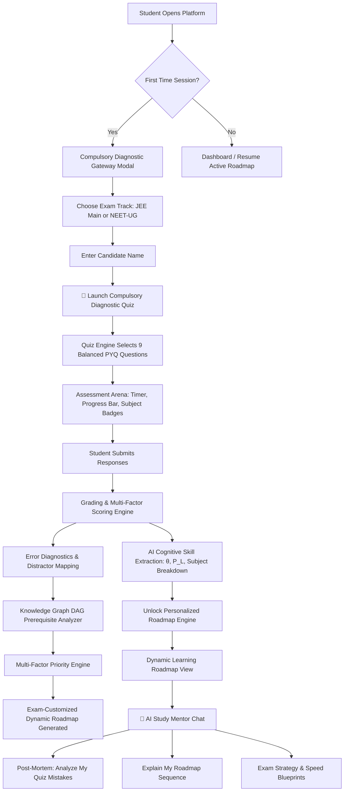

# Adaptive Student Intelligence & Dynamic Roadmap Engine: System Manual & Technical Specification

> **Platform Version**: 3.0 (Production Ready)  
> **Supported Exam Tracks**: JEE Main (PCM), NEET-UG (PCB), UPSC (Civil Services)  
> **Offline-First Architecture**: 100% Local Inference & Embedded SQLite — Zero External Cloud Dependency Required

---

## 📑 Table of Contents

1. [Executive Summary & Core Philosophy](#1-executive-summary--core-philosophy)
2. [High-Level System Architecture & Flow](#2-high-level-system-architecture--flow)
3. [Compulsory Diagnostic Gateway & Onboarding Flow](#3-compulsory-diagnostic-gateway--onboarding-flow)
4. [Authentic PYQ Question Banks with Modified Data](#4-authentic-pyq-question-banks-with-modified-data)
5. [Assessment Arena & Diagnostic Quiz Engine](#5-assessment-arena--diagnostic-quiz-engine)
6. [Cognitive Student Modeling & Mathematical Framework](#6-cognitive-student-modeling--mathematical-framework)
7. [Exam-Customized Dynamic Roadmap Engine (JEE vs NEET)](#7-exam-customized-dynamic-roadmap-engine-jee-vs-neet)
8. [Quiz-Grounded AI Study Mentor](#8-quiz-grounded-ai-study-mentor)
9. [Append-Only Telemetry & Audit Stream](#9-append-only-telemetry--audit-stream)
10. [Complete REST API Reference](#10-complete-rest-api-reference)
11. [Database Schema & Entity-Relationship Architecture](#11-database-schema--entity-relationship-architecture)
12. [Local Setup, Execution, and Verification](#12-local-setup-execution-and-verification)

---

## 1. Executive Summary & Core Philosophy

The **Adaptive Student Intelligence & Dynamic Roadmap Engine** is an offline-capable pedagogical system engineered to solve the fundamental flaw of traditional exam preparation: **rote memorization and static study plans**.

Instead of treating exams as uniform question sets, this platform measures **true latent cognitive mastery**:

1. **Compulsory Diagnostic Gateway**: Upon first opening the platform, students must choose their exam battleground (**JEE Main** or **NEET-UG**).
2. **Authentic PYQs with Modified Data**: Questions are adapted directly from official Past Year Questions (2021–2023), but **numerical values, constants, and contextual variables are altered**. Rote memory fails; only true conceptual derivation succeeds.
3. **Pre-Computed Solutions & Distractor Diagnostics**: Every question contains complete, mathematically verified step-by-step derivations ("*the answer is inside the engine's brain*"). Incorrect options map to explicit cognitive error patterns (`CONCEPTUAL_ERROR`, `CALCULATION_ERROR`, `FORMULA_SELECTION_ERROR`, `SIGN_ERROR`, `CARELESS_ERROR`).
4. **AI Cognitive Skill Extraction**: The engine extracts Latent Ability ($\theta$) via Item Response Theory (IRT), probabilistic knowledge state $P(L)$ via Bayesian Knowledge Tracing (BKT), and subject-by-subject accuracy meters.
5. **Prerequisite-First Dynamic Roadmap Generation**: The engine identifies root-cause foundational gaps using a Directed Acyclic Graph (DAG) and dynamically sequences study milestones, customized specifically for **JEE** (multi-concept mechanics/calculus) or **NEET** (high-speed NCERT recall & 50% Biology paper weighting).
6. **Quiz-Grounded AI Study Mentor**: An offline-first pedagogical mentor that directly analyzes the student's recent quiz performance, explains their exact mistakes, provides complete derivations, and explains roadmap decisions.

---

## 2. High-Level System Architecture & Flow



---

## 3. Compulsory Diagnostic Gateway & Onboarding Flow

When a student arrives at `http://127.0.0.1:8000/`, the gateway modal (`#onboardingModal`) is automatically presented if no previous assessment attempt exists:

* **Track Selection Cards**:
  * 🔭 **JEE Main (PCM)**: Physics, Chemistry, Mathematics (Mechanics, Physical Equilibrium, Calculus, GOC). Emphasizes multi-step reasoning and coordinate axis framing.
  * 🧬 **NEET-UG (PCB)**: Biology, Physics, Chemistry (NCERT Cell Biology, Genetics, Human Physiology, Ray Optics, Ionic Equilibrium). Emphasizes high-speed recall and 50% Biology paper weight.
* **Interactive Feedback**:
  * Real-time glow borders (`--border-highlight` and `--shadow-neon-md`).
  * Checkmark indicator on active card.
* **Profile Creation**: Candidate Name input with automatic UUID fallback (`std_...`).
* **Educational Briefing**: Transparently informs the student of the 3-step diagnostic pipeline.

---

## 4. Authentic PYQ Question Banks with Modified Data

### 4.1. The "Modified Data" Principle
To prevent students from relying on memorized answers from past year question papers, all questions maintain the **authentic pedagogical structure of official NTA papers**, but have their parameters altered:

* **Example (JEE Mechanics - Projectile/SHM)**: Standard paper parameters changed from $m = 2\text{ kg}, k = 200\text{ N/m}$ to $m = 1.5\text{ kg}, k = 150\text{ N/m}$.
* **Example (JEE Chemistry - Chemical Equilibrium)**: Reaction $N_2 + 3H_2 \rightleftharpoons 2NH_3$ analyzed with modified stoichiometric volumes and temperature to evaluate $\Delta n_g = -2$ and $K_p/K_c = 1/(RT)^2$.
* **Example (NEET Biology - Cardiac Output)**: Heart rate changed to $72\text{ bpm}$, $EDV = 125\text{ mL}$, $ESV = 50\text{ mL}$ ($SV = 75\text{ mL}$, $\text{Cardiac Output} = 5.40\text{ L/min}$).
* **Example (NEET Physics - Optics Prism)**: Angle of prism $A = 60^\circ$, refractive index $\mu = \sqrt{3}$, calculating angle of minimum deviation $D_m = 60^\circ$.
* **Example (NEET Chemistry - Ionic Buffer)**: $0.20\text{ M } CH_3COOH$ and $0.02\text{ M } CH_3COONa$ ($pK_a = 4.74$) calculating $pH = 3.74$.

### 4.2. Pre-Computed Verified Derivations
Every question in `data/questions/jee_questions.json` and `data/questions/neet_questions.json` includes:
* `explanation`: Complete mathematical and conceptual step-by-step proof.
* `distractor_explanations`: Exact diagnosis for each wrong option (e.g., Option B explains why a student made a sign error or inverted a ratio).

### 4.3. Cognitive Error Classification Taxonomy
```
+---------------------------+--------------------------------------------------------------+
| Error Type                | Definition & Clinical Diagnostic Indicator                  |
+---------------------------+--------------------------------------------------------------+
| CONCEPTUAL_ERROR          | Misunderstood physical law or biological classification.    |
| CALCULATION_ERROR         | Arithmetic slip or exponent mistake despite correct formula. |
| FORMULA_SELECTION_ERROR   | Inappropriate formula applied under active boundary conditions.|
| SIGN_ERROR                | Inverted ratio, vector sign slip, or Delta n_g inverted.     |
| CARELESS_ERROR            | Overlooked unit conversions or negative keywords (e.g. NOT).|
+---------------------------+--------------------------------------------------------------+
```

---

## 5. Assessment Arena & Diagnostic Quiz Engine

### 5.1. Multi-Subject Balanced Selection Algorithm
For a diagnostic test of count $N = 9$:
* **JEE Main**: Exactly 3 Physics + 3 Chemistry + 3 Mathematics = 9 items.
* **NEET-UG**: Exactly 3 Biology + 3 Physics + 3 Chemistry = 9 items.

Implemented in `backend/app/assessment/question_selector.py`:
```python
if diagnostic_goal in ["DIAGNOSTIC", "BASELINE"]:
    subjects = ["Physics", "Chemistry", "Mathematics"] if exam == "JEE" else ["Biology", "Physics", "Chemistry"]
    per_subject_count = count // len(subjects)  # 9 // 3 = 3 per subject
```

### 5.2. Assessment Arena UI Features
* **Live Countdown Timer**: Formatted in monospace font (`⏱ MM:SS`); transitions to rose alert styling when under 3 minutes.
* **Animated Progress Track**: Real-time percentage completion indicator (`.quiz-progress-track`).
* **Subject & Context Pills**:
  * Physics (Bioluminescent Cyan)
  * Chemistry (Emerald Green)
  * Mathematics (Purple)
  * Biology (Warm Amber)
  * `📌 PYQ (Data-Adapted)` tag
* **Keyboard Shortcut Navigation**:
  * Keys `1`, `2`, `3`, `4` or `A`, `B`, `C`, `D` select options instantly.
  * `ArrowRight` advances to next question; `ArrowLeft` navigates back.
* **Jump Pills**: Quick navigation buttons indicating answered questions with checkmarks.

---

## 6. Cognitive Student Modeling & Mathematical Framework

### 6.1. Multi-Factor Baseline Mastery
The platform computes a composite mastery index $M \in [0.0, 1.0]$:
$$M = w_1 \cdot \text{Acc} + w_2 \cdot \text{Diff} + w_3 \cdot \text{RecentAcc} + w_4 \cdot R(t) + w_5 \cdot \text{Consist} + w_6 \cdot \text{Speed}$$

Where:
* $\text{Acc}$: Historical raw accuracy.
* $\text{Diff}$: Difficulty-weighted success rate.
* $\text{RecentAcc}$: Exponential moving average over last 5 attempts ($\alpha = 0.35$).
* $R(t)$: Ebbinghaus retention decay factor.
* $\text{Consist}$: Variance penalty ($1 - \text{Var}$).
* $\text{Speed}$: Latency factor compared against estimated time.

### 6.2. Confidence & Uncertainty Calibration
$$\text{Confidence} = 0.85 \cdot \left(1 - e^{-N / 5.0}\right) + 0.15 \cdot (1 - \sigma^2)$$
* $N = 0 \implies \text{Confidence} \approx 0.0$ (High uncertainty).
* $N \ge 10$ and low variance $\implies \text{Confidence} \approx 0.95$.

### 6.3. Bayesian Knowledge Tracing (BKT)
Tracks hidden knowledge state transitions $P(L_t)$:
$$P(L_t \mid \text{Correct}) = \frac{P(L_{t-1}) \cdot (1 - P(S))}{P(L_{t-1}) \cdot (1 - P(S)) + (1 - P(L_{t-1})) \cdot P(G)}$$
$$P(L_t \mid \text{Incorrect}) = \frac{P(L_{t-1}) \cdot P(S)}{P(L_{t-1}) \cdot P(S) + (1 - P(L_{t-1})) \cdot (1 - P(G))}$$
$$P(L_{t+1}) = P(L_t) + (1 - P(L_t)) \cdot P(T)$$
Standard Parameters: $P(L_0) = 0.20, P(T) = 0.15, P(G) = 0.20, P(S) = 0.10$.

### 6.4. Item Response Theory (IRT 2PL / 3PL)
Estimates student latent ability $\theta \in [-3.0, +3.0]$:
$$P(X_i = 1 \mid \theta) = c_i + \frac{1 - c_i}{1 + \exp\left(-a_i (\theta - b_i)\right)}$$
* $a_i$: Discrimination parameter ($1.0 - 2.0$).
* $b_i$: Difficulty parameter (normalized to $\theta$ scale).
* $c_i$: Pseudo-guessing parameter ($0.25$ for 4-option MCQs).
* Student $\theta$ updated using Newton-Raphson maximum likelihood / Bayes modal estimation.

### 6.5. Ebbinghaus Forgetting & Retention Decay
$$R(t) = \exp\left(-\frac{\ln 2}{S} \cdot t\right), \quad S = S_0 \cdot (1 + 0.5 \cdot \text{Reviews})$$
Concepts that have not been practiced decay over elapsed days $t$, triggering automatic **Retention Drills**.

---

## 7. Exam-Customized Dynamic Roadmap Engine (JEE vs NEET)

### 7.1. The Multi-Factor Priority Equation
$$\text{Priority} = \text{Gap} \times w_{\text{gap}} + \text{ExamWeight} \times w_{\text{exam}} + \text{PrereqImpact} \times w_{\text{prereq}} + \text{ForgettingRisk} \times w_{\text{decay}} + (1 - \text{Confidence}) \times w_{\text{unc}}$$

### 7.2. Specific Differences: JEE vs NEET

| Parameter | JEE Main Track | NEET-UG Track |
| :--- | :--- | :--- |
| **Primary Focus** | Multi-concept problem synthesis, calculus-mechanics integration | Factual recall precision, high-speed NCERT drills |
| **Biology Weight** | N/A | **50% of entire exam** ($360/720$ marks); exam importance boosted by $1.25\times$ |
| **Prerequisite Weight** | Heavy weight ($0.25$) on deep prerequisite cascades | Balanced weight ($0.15$) with rapid concept remediation |
| **Pacing Requirement** | $\sim 2.0 - 2.5$ minutes per problem | $\sim 45 - 50$ seconds per problem |
| **Action Types** | `JEE_FOUNDATION_REBUILD`<br>`JEE_MAIN_SPRINT`<br>`JEE_MULTI_CONCEPT_DRILL`<br>`JEE_ADVANCED_PRACTICE`<br>`JEE_TRANSFER_TEST` | `NEET_NCERT_CORE_RECALL`<br>`NEET_HIGH_SPEED_DRILL`<br>`NEET_APPLICATION_PRACTICE`<br>`NEET_720_TARGET_SPRINT`<br>`NEET_TRANSFER_TEST` |
| **Strategic Reasoning** | Emphasizes $+4/-1$ negative marking protection and coordinate framing | Emphasizes zero unforced errors, keyword recall, and speed |

### 7.3. Prerequisite Gap Interception (DAG Tracing)
Before scheduling an advanced concept, the engine calls `PrerequisiteResolver.analyze_prerequisite_chain`:
1. If ancestors in the NetworkX graph have mastery $< 0.70$, they are declared **Broken Prerequisites**.
2. The engine inserts the broken prerequisite at **Step 1** with priority score `0.95` and reasons explaining why it unblocks downstream topics.

---

## 8. Quiz-Grounded AI Study Mentor

### 8.1. Context Extraction Pipeline
When the student sends a message to `/api/ai/chat/{student_id}`:
1. The backend retrieves the student's latest `AssessmentAttempt`.
2. Gathers every `StudentAttemptItem` with:
   * Student answer vs correct answer
   * Question text snippet
   * Concept ID & Subject
   * Identified error pattern
   * Distractor diagnostic note & complete step-by-step derivation
3. Extracts current active roadmap milestones (Steps 1–6) and reasons.
4. Synthesizes a structured profile and passes it to `LocalLLMClient`.

### 8.2. Dual-Engine Architecture
* **Mode 1 (Local Ollama LLM)**: If a local Ollama server is running (`http://localhost:11434`, e.g. Llama-3), the AI uses the serialized context prompt to produce natural language responses.
* **Mode 2 (Deterministic Student Intelligence Fallback)**: If offline or Ollama is not installed, the engine uses **deterministic pedagogical rules** to answer with exact mathematical precision:
  * **"Analyze my quiz mistakes"**: Provides a post-mortem of every question missed, why the selected option was wrong, and the step-by-step solution.
  * **"Explain my roadmap sequence"**: Explains why Step 1 was chosen, what prerequisite gap it fixes, and the target mastery required.
  * **"Give me exam strategy tips"**: Delivers a tailored section-by-section time management blueprint (JEE 3-pass protocol or NEET 45-minute Biology anchor).

---

## 9. Append-Only Telemetry & Audit Stream

Every learning action is immutably recorded in the `telemetry_events` table for analytics and compliance:

```json
{
  "event_id": 42,
  "student_id": "std_421255f110eb",
  "session_id": "sess_8912",
  "event_type": "ASSESSMENT_COMPLETED",
  "payload": {
    "attempt_id": "att_6f1837a2",
    "score_percentage": 77.78,
    "correct_count": 7,
    "total_questions": 9,
    "time_taken_seconds": 500
  },
  "timestamp": "2026-09-02T13:48:29.124Z"
}
```

---

## 10. Complete REST API Reference

### Authentication & Student Profile
* `POST /api/auth/register` — Register a candidate (`name`, `email`, `password`, `target_exam`).
* `POST /api/auth/login` — Login candidate.
* `GET /api/auth/profile/{student_id}` — Get profile, overall mastery, and confidence.

### Curriculum & Knowledge Graph
* `GET /api/curriculum/exams` — List supported exams (`JEE`, `NEET`, `UPSC`).
* `GET /api/curriculum/hierarchy/{exam_id}` — Get full hierarchy (Exam $\rightarrow$ Subject $\rightarrow$ Chapter $\rightarrow$ Topic $\rightarrow$ Concept).
* `GET /api/curriculum/graph/{exam_id}` — Get NetworkX DAG nodes and edges with student mastery status.
* `GET /api/curriculum/concept/{concept_id}` — Detailed concept metadata and prerequisites.

### Assessments & Diagnostic Testing
* `POST /api/assessments/start?student_id={id}` — Start Tier 1 adaptive screener assessment (9 Qs balanced across subjects).
* `POST /api/assessments/start-drill?student_id={id}&subject={s}&chapter_id={c}` — Start Tier 2 targeted topic drill (5 Qs).
* `POST /api/assessments/start-full-scan?student_id={id}&exam={e}` — Start Tier 3 full syllabus deep scan (15 Qs).
* `POST /api/assessments/submit` — Submit answers (`attempt_id`, `responses`), triggers grading, mastery update, weak subject detection, and roadmap regeneration.
* `GET /api/assessments/history/{student_id}` — List past assessment attempts.
* `GET /api/assessments/attempt/{attempt_id}` — Get question-by-question feedback and distractor notes.

### Dynamic Roadmap
* `GET /api/roadmap/active/{student_id}` — Get active calibrated roadmap actions.
* `POST /api/roadmap/regenerate/{student_id}` — Force roadmap recalculation.
* `GET /api/roadmap/next-action/{student_id}` — Get current Next-Best-Action (NBA).
* `POST /api/roadmap/action/{action_id}/complete` — Mark action completed.
* `GET /api/roadmap/weaknesses/{student_id}` — Get ranked list of active knowledge gaps.

### AI Study Mentor
* `POST /api/ai/chat/{student_id}` — Context-grounded chat using deterministic `IntentClassifier` (`prompt`, `include_student_state`).
* `POST /api/ai/generate-question` — Generate practice question with distractor analysis.

### Supporting Features
* `GET /api/supporting/review-queue/{student_id}` — Query concepts due for spaced review via Ebbinghaus retention decay ($R(t) < 0.65$).
* `GET /api/supporting/error-trends/{student_id}` — Aggregated cognitive error patterns and subject tendencies.
* `GET /api/supporting/report-card/{student_id}` — Complete printable scorecard data for PDF export.

### Telemetry Stream
* `GET /api/telemetry/stream/{student_id}` — Fetch append-only audit trail.

---

## 11. Database Schema & Entity-Relationship Architecture

```
+------------------+       +---------------------+       +-----------------------+
|     students     | 1---* | assessment_attempts | 1---* | student_attempt_items |
+------------------+       +---------------------+       +-----------------------+
        | 1                           | 1                            | *
        |                             |                              |
        | *                           v 1                            v 1
+-----------------------+  +---------------------+       +-----------------------+
|student_concept_mastery|  |     assessments     |       |       questions       |
+-----------------------+  +---------------------+       +-----------------------+
        | *                           |                              |
        |                             |                              |
        v 1                           v                              v 1
+------------------+       +---------------------+       +-----------------------+
|     concepts     | <---* |     prerequisites   |       |   topics / chapters   |
+------------------+       +---------------------+       +-----------------------+
        ^ 1
        |
        | *
+------------------+       +---------------------+
| roadmap_actions  | *---1 |      roadmaps       |
+------------------+       +---------------------+
```

---

## 12. Local Setup, Execution, and Verification

### 12.1. Prerequisites
* Python 3.10+ (Tested on Python 3.14 on Windows)
* Dependencies:
  ```bash
  pip install fastapi uvicorn sqlalchemy networkx numpy scipy pydantic pytest httpx
  ```

### 12.2. Running Automated Unit Tests
```bash
python -m pytest -v
```
*Executes all 15 automated test suites across IRT, BKT, DAG Prerequisites, Priority Engine, Roadmap Regeneration, Chatbot Intent Classifier, and Supporting Features.*

### 12.3. Starting the Server
```bash
python -m uvicorn backend.app.main:app --host 127.0.0.1 --port 8000
```

### 12.4. Accessing the Platform
* **Web UI**: Open `http://127.0.0.1:8000/` in Google Chrome, Edge, or Firefox.
* **Interactive OpenAPI Docs**: `http://127.0.0.1:8000/docs`
* **Alternative ReDoc**: `http://127.0.0.1:8000/redoc`

---

## 13. Platform Upgrade v3.0 Architecture Additions

### 13.1. Tiered Diagnostic Testing Pipeline
* **Tier 1 — Screener**: 9-Question compulsory balanced diagnostic. Calculates overall latent ability and flags weak subjects ($< 60\%$ accuracy).
* **Tier 2 — Topic Drill (`POST /api/assessments/start-drill`)**: 5-Question focused PYQ drills targeting isolated chapters/concepts for weak subjects.
* **Tier 3 — Full Syllabus Deep Scan (`POST /api/assessments/start-full-scan`)**: 15-Question balanced deep scan covering all major syllabus chapters.

### 13.2. Hardened Offline Chatbot (`IntentClassifier` + `templates.py`)
* Two-stage deterministic classification (Regex/Keyword + Levenshtein fuzzy distance matching).
* Fixed intent set: `ANALYZE_MISTAKES`, `EXPLAIN_ROADMAP`, `STRATEGY_TIPS`, `EXPLAIN_CONCEPT`, `UNKNOWN`.
* Zero hallucinations: slot-filling templates populate directly from the student's quiz answers, distractor traps, and roadmap DAG.

### 13.3. Interactive Visual Roadmap
* **Visual DAG Graph**: Native SVG rendering with directional prerequisite arrows, zoom/pan controls, and color-coded status badges (🟢 Mastered $\ge 70\%$, 🟡 Developing $40-69\%$, 🔴 Weak $< 40\%$).
* **Chapter Heatmap**: Aggregated chapter-level mastery cards with weak-gap indicators and direct drill triggers.
* **Dashboard Widgets**: Circular SVG Progress Ring and Next 3 Priority Milestones.

### 13.4. Supporting Features
* **Spaced Repetition Review Queue (`GET /api/supporting/review-queue/{id}`)**: Schedules practice based on Ebbinghaus memory decay ($R(t) = e^{-t/S} < 0.65$).
* **Cognitive Error Trends (`GET /api/supporting/error-trends/{id}`)**: Aggregates distractor tendencies across subjects and categories (time pressure, calculation slips, conceptual confusion).
* **Printable / Exportable Report Card (`GET /api/supporting/report-card/{id}`)**: Official audit scorecard with clean `@media print` CSS for PDF generation.

